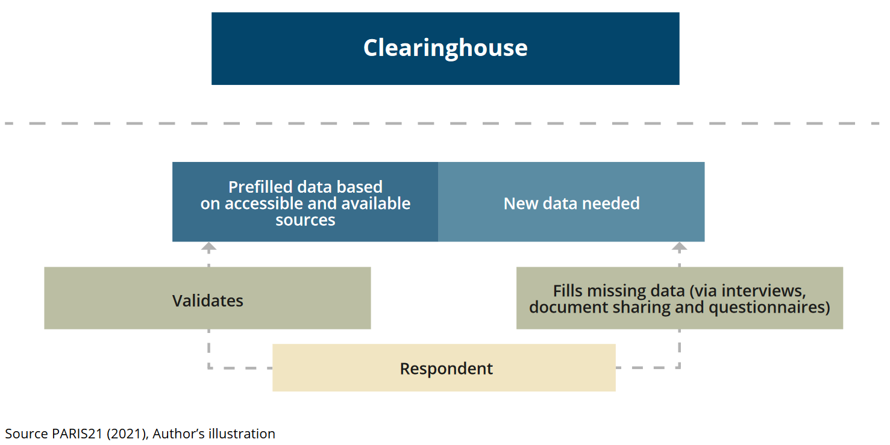

# About the Data {#about-the-data}

The Clearinghouse for Financing Development Data is a hub of data originating from a variety of different sources. The majority of data in the Clearinghouse comes from existing sources, including large data bases issued by the World Bank or the OECD. A small share of data related to financing opportunities is collected via pilot assessments. The following chapter sets out to explain the data, its limitations and processing treatment. For an overview of which part of the Clearinghouse platform is informed by which data source, please refer to Table \@ref(tab:data-sources). 

## Financial Support to Statistics and Data

The foundation of the Clearinghouse data forms the database created for PARIS21’s annual Partner Report to Support to Statistics (PRESS), which provides a comprehensive picture of international support to statistics issued from development providers. PRESS draws on the OECD’s Creditor Reporting System (CRS), which records project-level data from OECD Development Assistance Committee (DAC) members (donors), non-DAC donors, as well as private institutions. The DAC members are required to report via the CRS, the non-DAC members and private institutions report on a voluntary basis. This provides a comprehensive account of Official Development Assistance (ODA). Donors report to the CRS using specific codes for the sectors targeted by their aid activity. While each activity reported in CRS can only be assigned with one of the over 100 purpose codes, Statistical Capacity Building (SCB) is designated by the sector code 16062. 

To assemble the database for PRESS, a two-step analytical process is applied that combines targeted filtering with AI-supported classification. In the first step, projects are pre-identified as statistical based on their assignment to the SCB purpose code and the presence of statistical keywords in project titles. The resulting subset of verified statistical projects serves as a training dataset for the subsequent application of an LLM. In the second step, the trained model is applied to the remaining CRS dataset to detect projects with significant statistical components, even when these are not explicitly labelled or coded as such, thereby ensuring that the database provides a comprehensive up-to-date reference of information on funding towards statistical systems.[^1]

[^1]: For more detailed information on the PRESS methodology, please consult the [PRESS methodology note](https://paris21-data.github.io/PRESS/).

In addition to the PRESS database, the Clearinghouse incorporates data on statistical capacity building directly provided by the International Monetary Fund (IMF), as these direct contributions are not reflected in the CRS and stem from IMF’s core budget.  

Together, the PRESS database, complemented by project-level data directly provided by the IMF, constitutes the foundation for both the project-level funding information on providers’ and recipient pages, as well as the aggregated global funding flows presented on the Clearinghouse platform. To enable the display of data in various aggregated forms and to enrich the analysis by thematic dimensions, the Clearinghouse also integrates supplementary information related to the Sustainable Development Goals (SDGs), the classification of statistical activities, and the categorisation of projects to relevant government functions.  

<a id="SDG" style="text-decoration:none; color:black"></a> 
**Classifying data according to Sustainable Development Goals.** 
Each project in the Clearinghouse is tagged with the appropriate SDGs. While the CRS enables to assign SDG-markers to each project, for projects lacking such tagging, the project team made use of the [Aurora SDG classifier](https://aurora-universities.eu/sdg-research/) (Vanderfeesten et al., 2022) via its public API, developed by the [Aurora Universities Network](https://aurora-universities.eu/about/). This classifier is based on a fine-tuned LLM that was trained on a corpus of 1.4 million academic abstracts in multiple languages and subsequently applied to classify texts against the 17 SDGs. Multilinguality is critical given that development-aid project titles and descriptions are often authored in non-English languages, so the classifier’s ability to process multiple languages broadens coverage beyond English-only tools. Each project’s title and description are submitted to the API, which returns a score for each of the 17 SDGs. All SDGs with a score above 0.2 are selected; if none surpasses 0.2, the SDG with the highest score is retained. The result is an SDG assignment that enables further insight into the thematic relevance of provider funding. 

<a id="CSA" style="text-decoration:none; color:black"></a> 
**Classifying data according to statistical activities.** 
Both donors and recipients may be interested in analysing the distribution of projects by statistical activities. To facilitate this analysis, the project team implemented a machine learning–based classifier to assign PRESS projects to the five domains of the [Classification of Statistical Activities](https://unstats.un.org/unsd/classifications/CSA2) (CSA). Although the CSA was updated in 2023, the project team decided to retain the earlier version of the classification to ensure consistency and comparability with previous updates of the Clearinghouse platform. 

In applying the CSA classification, projects may be associated with more than one statistical domain. Consequently, the machine learning model predicts zero or more mutually non-exclusive class labels. The algorithm analyses the project description (where available, and the name of the project otherwise), to determine the statistical domains most relevant to each project, all while respecting the multilingual reporting character of project titles and descriptions. The classifier was trained on a curated dataset of PRESS projects, limited to those reported after 2012 to account for changes in reporting standards introduced that year. For each of the five statistical domains, the model estimates the probability of association, and a project is assigned to a given domain when this probability exceeds 0.5. 

<a id="COFOG" style="text-decoration:none; color:black"></a> 
**Classifying data according to functions of government.** 
The projects are also classified based on [government functions](https://unstats.un.org/unsd/classifications/cofog/revision) (COFOG). In a first step, the project team has mapped the 38 sector codes in the CRS to the ten first-level functions of the government through a one-to-one correspondence. No sector code has been mapped to the function of government 2 (Defence) since it is unlikely that statistical projects refer to this government function. Similarly, there was no possible mapping between the function of government 8 (Recreation, culture and worship) and the CRS sector codes. In the future, the project team aims at classifying the projects that do not have any sector code associated through a text-mining algorithm. This algorithm has not yet been implemented. It aims at using a training set of CRS project-level information and predicts the function of government associated to each project based on its description. In order to avoid multicollinearity, the machine learning algorithm would only consider the resulting eight functions of the government, each of them with a non-zero number of projects associated. Different from the classification of statistical activities, the one-to-one correspondence between sector codes and government functions would guarantee that each project is only associated to one function of government. The resulting algorithm would implement a multi-class classification with mutually exclusive labels and predicts the probability for which a project is related to each of the eight government functions. 


## Financing Opportunities in Statistical Systems

For providing information beyond the current funding situation as measured in PRESS, the Clearinghouse project team launched a pilot assessment for a selected group of countries to gain fine-grained information on the funding needs of the respective statistical system. This information serves as the basis for the detailed project information displayed on the *in-depth* recipients’ profiles. 

#### PARIS21 - Pilot assessments {-}

The project team launched four in-depth assessments in July and August 2021 to explore the financing opportunities in partner countries. The countries selected to pilot the assessment included Malawi, Rwanda, Gambia, Niger, Lesotho and the Dominican Republic.[^2] The objective of the pilot assessments were: 

[^2]: The countries were chosen based on the following criteria: i) IDA eligible, ii) data availability based on CRESS and NSDS reports.

  - Collect (forward-looking) project-level data on financing needs from the National Statistical Office and NSS entities. 
  - Understand recipient priorities and budget planning processes relevant to statistics and data across the national statistical system. 
  - Capture political processes in securing external funding with international organisations, mobilizing domestic funding on the ground. 
  - Strengthen NSS in a participatory and holistic manner.  

The project team designed and administered one questionnaire and one interview guideline to the NSO as well as at least five selected NSS entities (line ministries) in each of the countries. A local consultant supported the work of the project team by coordinating with the respective institutions and supporting them to fill in the questionnaire in a standardized manner. The consultant also conducted the qualitative interviews.  

In order to reduce the reporting burden of the NSO and the NSS entities, the questionnaire was prefilled with budget data extracted from NSDS budget tables or PARIS21 Country Support to Statistics (CRESS) analyses. Starting from the available NSDS documents or CRESS data, the costing tables are identified and analysed. The budget data is extrapolated in a machine-readable format containing as much information as possible on projects related to statistics and related to the NSS entity in charge of it. All the available project-level information is included in a comprehensive dataset for each country. The project team developed two selection criteria in order to prefill the questionnaire for each of the NSS entities in the country. Each questionnaire is prefilled with ten projects with the largest total budget share for each entity. Moreover, the questionnaire also includes prefilled information on projects related to CRVS, SDG and gender due to the strategic importance for the Clearinghouse. Each project contains as much information as it is retrieved from the NSDS or CRESS in order to facilitate the identification, revision and validation process of the respondent. In total, 23 questionnaires on budget information were collected.  

The qualitative interviews usually lasted 30 – 90 minutes and followed an interview guideline. The local consultant could report the interviews in rare cases where the institution was responsive. In total, 24 qualitative interviews were conducted. 

Some limitations arose during the process of the structured assessment. Firstly, the pilot assessments followed an explorative approach taking into account the countries specific national statistical system and institutions. While this allowed for deep insights into the financial ecosystem of development data and resulted in lessons learned on the political decision-making and budget planning processes, the scaling of such assessments requires further standardization and harmonisation of methodologies across countries. Secondly, the pilot assessments were only able due to close collaboration between the NSO in the partner country and PARIS21, involving the work of two analysts and one local consultant per pilot. The financial and human resources involved to collect such granular data are not sustainable in the long-run and require the Clearinghouse to move to more data reporting (integrative methods). Thirdly, the COVID-19 pandemic in 2021 led to significant delays in work on the ground and inhibited direct intervention by the project team. In the future, the data collection for a similar pilot could be conducted more efficiently and effectively during a one-week mission to the respective country. 

The data obtained through the pilot assessments were processed by the project team. Firstly, the validity of the answer format was checked visually. The answers with clear format errors were corrected and minor input errors were modified. For instance, text inputs for the questions which require numerical input were modified considering the context. Secondly, all the budget information was processed to display the domestic currency unit. To check the validity of the budget data indicated, we applied period-average exchange rates (domestic currency per U.S. Dollar) from the IMF International Financial Statistics (IFS) for adequate currency conversion. The budget information in foreign currency units was initially converted to the value in U.S. Dollar applying a period-average exchange rate (foreign currency per U.S. Dollar) and the budget in U.S. Dollar was converted to the value in domestic currency applying a period-average exchange rate (domestic currency per U.S. Dollar). The period-average exchange rate in 2020 was applied for the exchange rate in FY2020. We made a provisional assumption of minimum exchange rate fluctuation in the coming years and also applied the exchange rate in 2020 for FY2021, FY2022, FY2023, FY2024 and FY2025. After the validity check, the budget information on the platform is displayed in local currencies and USD. The qualitative interviews were manually checked and critical information was reduced to comprehensive bullet points to ensure adequate storage in the database. The results are displayed on the respective recipient profiles on the platform. 

```{r pilot-assessment, echo=FALSE, fig.align="center", fig.cap = "Structure of the pilot assessments.", out.width="75%" }

```


## Statistical Performance

In addition to information directly related to financing data and statistics, the Clearinghouse displays benchmarks to assess statistical capacity and performance in recipient countries. This can help development cooperation providers to target their support more effectively and assess the investment opportunity more holistically. 
 
#### World Bank – Statistical Performance Indicators {-}

The World Bank Statistical Performance Index (SPI) Overall Score is included in the Clearinghouse recipient profiles to give a benchmark on the overall maturity of statistical systems. The score reports a value ranging between 0 and 100, computed as the average of the five pillars that compose it, the data use, data services, data products, data sources and data infrastructure pillars. This index provides a summary measure of statistical performance and maturity of a statistical system, comparable across countries and over time, taking into account the key pillars of a country’s statistical performance and the dynamic data ecosystem in which it operates. 

The SPI developed by the World Bank does not yet cover all aspects of a modern data ecosystem. In spite of large improvements, there are certain areas of data sharing and use by modern actors such as civil society, academia and private sector that are not yet measured on a global scale due to lack of harmonization and country-level specificities. Moreover, methodology-proof indicators do not yet exist and prevent from measuring some key dimensions of statistical performance in the modern data ecosystem. Additional information on the SPI can be found [here](https://datanalytics.worldbank.org/SPI/). 

#### PARIS21 – Statistical Capacity Monitor {-}

The project team has selected four indicators from the Statistical Capacity Monitor that are included in the Clearinghouse recipient profiles. Altogether, the indicators provide a geographical and temporal comparable overview over the maturity of a statistical system in a country. The indicators reported are [National Statistical Council](https://statisticalcapacitymonitor.org/indicator/67/), [Use of Statistics index](https://statisticalcapacitymonitor.org/indicator/127/), [Statistical Plan Fully Funded](https://statisticalcapacitymonitor.org/indicator/138/) and the [Compliance with the UN’s Fundamental Principles of Statistics indicator (SDG 17.18.2)](https://statisticalcapacitymonitor.org/indicator/135) whose source and dissemination agency is PARIS21. These indicators give insights into the maturity of the national statistical system along different phases of the data value chain, respectively, planning, use, investment and production. 

The indicators are built from analytical desk research (National Statistical Council), text-mining methodology (Use of Statistics index) and survey responses conducted in cooperation with UNSD (Statistical Plan Fully Funded, UN FPOS compliance). All three indicators do not dispose over a global country coverage. The country coverage can be explained either by lack of available underlying data to construct the indicator for some countries or missing/absent information. In the case of missing data, no imputation procedure is adopted. An additional limitation of these indicators is the limited time series. Since the work on statistical capacity measurement is relatively recent, the indicators start as of 2017. 


#### Open Data Watch - Open Data Inventory (ODIN) {-}

ODIN monitors the progress of open data that are relevant to the economic, social, and environmental development of a country. The ODIN overall score (data coverage and openness) which is featured on recipients’ pages captures the public availability of official national statistics, as well as their adherence to open data standards. There are five availability (coverage) and five openness elements that are assessed by researchers for each of the 22 data categories. 

The ODIN assessment only looks for data on NSO websites and websites listed on these sites. In some cases, this may miss other data sites a country might use to publish data. In addition, the underlying scoring system of ODIN assessments does not allow for more nuance than 0, 0.5 or 1 for each element, though the nuance appears out of the several dozen indicators used for the assessment. For more information on the construction of ODIN, please consult the [Open Data Inventory 2024/25 Methodology Guide](https://docs.google.com/document/d/1q9QGI5svEY6RRmi7jkgQtX1Sjms3sznH/edit?rtpof=true&sd=true&tab=t.0). 


## Gender Data Financing

The Clearinghouse provides information on gender data financing through a dedicated gender data channel that highlights the funding flows, funding opportunities, and statistical performance on gender data for countries and regions. 

#### Gender Data Financing in PRESS {-}

Based on the projects identified as relevant to financing statistical activities to construct the PRESS database, the same projects were re-examined for relevance specifically to gender data financing. The identification of projects relevant to gender issues builds on a structured identification process that combines multiple criteria. Projects are included when they are marked with either of: 

  - CRS gender equality policy marker indicating gender equality as the principal project objective, 
  - CRS reproductive, maternal, newborn and child health (RMNCH) marker indicating RMNCH as the principal project objective, 
  - Gender-related purpose codes,
  - Funding channels primarily dedicated to gender issue (e.g. UN Women),
  - Donors primarily dedicated to gender issue (e.g. the Austrian Federal Ministry of Education and Women's Affairs), 
  - Gender-specific keywords and acronyms in project titles,
  - Detection via finetuned large language model (LLM) specifically trained to detect gender relevance applied to projects that lack explicit gender markers or keywords.[^3]
  
[^3]: For more detailed information on the identification procedure, please consult the [PRESS methodology note](https://paris21-data.github.io/PRESS/).

This multi-criteria approach ensures that both directly targeted and implicitly relevant projects are captured, providing a comprehensive and coherent overview of global financing flows for gender data.

#### Other Gender Data Sources {-}

The gender data channel and profiles synthesize multiple data sources to provide a comprehensive assessment of gender data financing, production, availability, and use within the national statistical system. The methodology draws upon analyses conducted by Open Data Watch and data compiled through various international monitoring frameworks. 

**Budget for National Statistics and Domestic Resources for Gender Data**

Understanding domestic resource allocation for gender data is essential for assessing national commitment and sustainability of gender statistics programs. 

  - Source: Open Data Watch analysis of [National Strategies for the Development of Statistics (NSDS)](https://www.paris21.org/project/nsds-strategic-planning-development-data), collected for Gender Data Compass. 
  - How: Systematic examination of NSDS documents to identify budget line items and resource allocation statements specifically earmarked for gender data collection, analysis, and dissemination activities. 
  
**Activities Funded by Gender Data Financing **

Knowing what types of activities receive funding reveals whether investments support the full data production pipeline or concentrate on specific areas. 

  - Source: Open Data Watch analysis of Clearinghouse projects flagged for gender data financing and according to [Classification of Statistical Activities](https://unstats.un.org/unsd/classifications/CSA2) (CSA 1.0). 
  - How: Detailed examination of registered projects to categorize funded activities such as survey design and implementation, capacity building, data processing infrastructure, dissemination platforms, and other essential components using the standardized CSA 1.0 framework.

***Gender Data System Instruments and Activities***

Mapping which data collection instruments are actively producing information identifies the operational components of a country's gender data system. 

  - Source: Open Data Watch analysis of microdata holdings from [World Bank](https://microdata.worldbank.org/index.php/home), [IHSN](https://catalog.ihsn.org/catalog/?page=1&ps=15), [FAO](https://www.fao.org/food-agriculture-microdata/en), [DHS](https://dhsprogram.com/Methodology/survey-search.cfm?pgtype=main&SrvyTp=country), [UNICEF](https://mics.unicef.org/surveys), [ILO](https://webapps.ilo.org/surveyLib/index.php/catalog/LFS/?page=1&ps=15&repo=LFS), and [UNSD](https://unstats.un.org/unsd/demographic-social/census/censusdates/)[ databases](https://unstats.un.org/UNSDWebsite/demographic-social/time-use/data-and-metadata), collected for Gender Data Compass. 
  - How: Comprehensive inventory of archived data collection instruments (household surveys, population censuses, administrative records, specialized modules, time-use surveys) to identify their frequency, geographic coverage, and thematic focus areas. 
  
***SDG 5 Data Availability***

Measuring data availability for gender equality indicators shows how well the international community can track progress toward SDG 5 targets. 

  - Source: UN Statistics Division [Data Availability dashboard](https://unstats.un.org/sdgs/dataportal/analytics/DataAvailability) of SDG database. 
  - How: Assessment of whether countries have reported data for each SDG 5 indicator, tracking both breadth of coverage across indicators and frequency of data updates. 
  
***Overall Gender Data Capacity Assessment***

Aggregate measures of gender data availability help benchmark a country's gender statistics ecosystem against international standards. 

  - Source: Open Data Watch [Gender Data Compass](https://genderdatacompass.org) and [Gender Data Outlook](https://www.paris21.org/knowledge-base/gender-data-outlook-2024) scores. 
  - How: Combined assessment examining quantity and quality of gender statistics across key thematic areas, along with comparative scores reflecting data availability, enabling environment, institutional capacity, and data openness. 
  

***Gender Data Use and Impact***

Documenting how gender data influences decision-making demonstrates the tangible value of investing in gender statistics and provides replicable models for strengthening data use. 

  - Source: Open Data Watch collection of inventories and individual case studies, based on [Gender Data Outlook](https://www.paris21.org/knowledge-base/gender-data-outlook-2024) data use inventory and supplementary case studies by partner countries. 
  - How: Systematic collection using adapted Gender Data Outlook typology to categorize data use types (policy design, program monitoring, advocacy, research, accountability) and trace pathways from data production through uptake to measurable impacts on gender equality outcomes. 


<br>
<br>

  
| Data Source                   | Funding Flows | Recipients Standard/Light | Recipients in-depth | Providers | Gender Financing |
|:------------------------------|:--------------|:--------------------------|:--------------------|:----------|:------------------|
| PRESS & IMF                   | ✓             | ✓                         | ✓                   | ✓          | ✓                |
| Pilot Assessment              |               |                            | ✓                   |            |                  |
| WB SPI data                   |               | ✓                          |                     |            |                  |
| P21 Stat. Capacity Monitor    |               | ✓                          |                     |            |                  |
| ODIN                          |               | ✓                          |                     |            | ✓                |
| Gender indices                |               |                            |                     |            | ✓                |
: (\#tab:data-sources) Overview of the data sources informing each part of the platform. 

<br>
<br>
<br>
